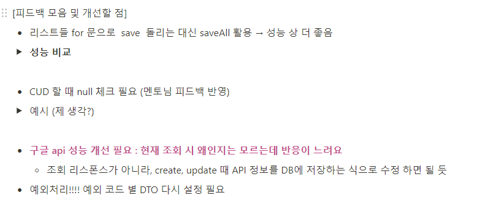
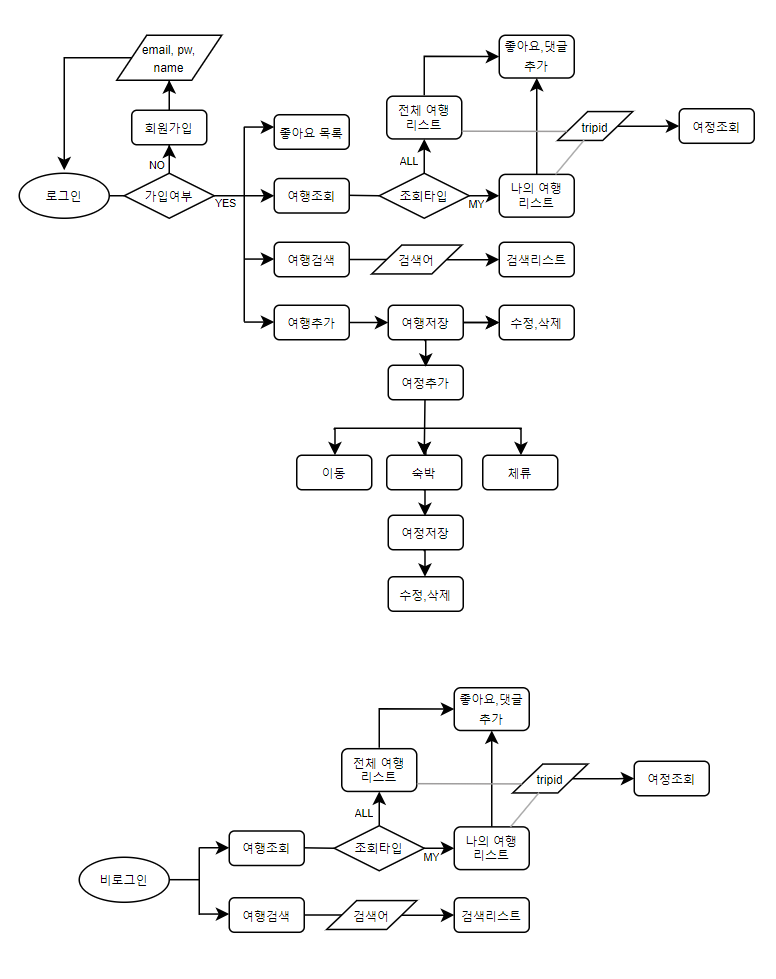
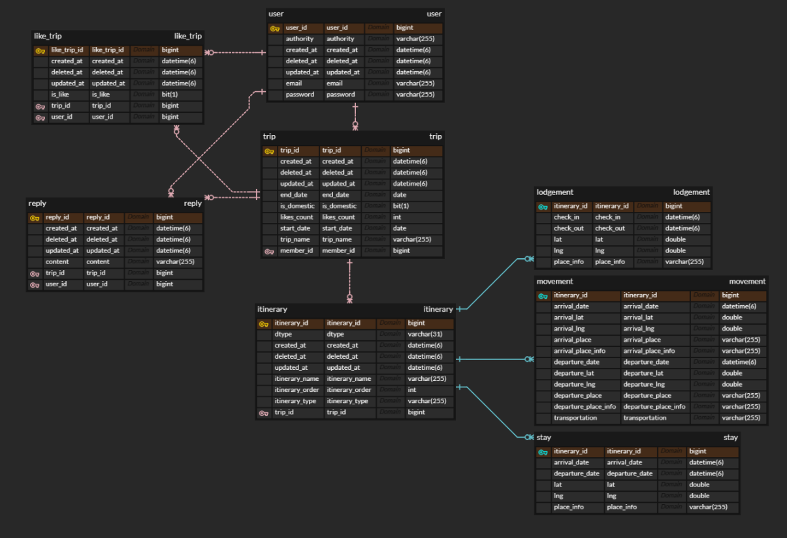

 6조 FastCampus ToyProject 
=======================

6조 토이프로젝트 입니다.

이름: 김종훈, 김현아, 성지운, 최혜미

- - -

### 프로젝트 사용 기술

- **언어** : OpenJDK 11
- **스프링 부트** : 2.7.17
- **스프링 부트 시큐리티** : 2.7.17
- **빌드** : Gradle 8.1.1
- **테스트** : Junit Jupiter 5.7.2
- **형상 관리** : Git
- **저장소** : GitHub
- **라이브러리 의존성** : Lombok, jjwt-jacson:0.11.5 etc.
- **DB** : MySQL

- - -

### 프로젝트 목표

1. 만들어진 프로젝트의 리팩터링
2. Spring Security를 이용한 인증.인가 처리
3. DB를 통한 데이터 영속성 구현
4. 테스트 코드 작성으로 코드의 완성도 보장


- - -

### 프로젝트 진행

- 실제 코딩을 한 리포지토리 입니다. GitHub Repository [link:GitHub](https://github.com/FC-BE-ToyProject-Team6/KDT_Y_BE_Toy_Project3_DEV)
- 코드 리뷰를 통해 적극적으로 의견 표출 [link:코드 리뷰 3차](https://github.com/FC-BE-ToyProject-Team6/KDT_Y_BE_Toy_Project3_DEV/pulls?q=is%3Apr+is%3Aclosed), [link:코드 리뷰 2차](https://github.com/FC-BE-ToyProject-Team6/KDT_Y_BE_Toy_Project2_DEV/pulls?q=is%3Apr+is%3Aclosed)


- - -

### 주요 프로젝트 기획

- 이전 프로젝트 피드백 


- 사용자 플로우 차트를 이용한 프로젝트 기획


- API 엔트포인트를 미리 기획하여 구현
- 작업을 분류별로 나누어 협업

### API EndPoint

API 문서(gitbook) : [link:gitbook](https://trip-itinerary-sns-api.gitbook.io/toyproject-03/)

### API Testcase

Postman 링크 : [link:postman_document](https://www.postman.com/winter-trinity-386393/workspace/toyproject3/documentation/11357776-e0fd65cd-d99a-40da-a814-2a170eb82f7d)

### 중요 실행 환경 설정!!

API_KEY : asdfasdfasdf


API_KEY를 위 사진처럼 실행 환경변수로 입력하여야 합니다.!!


### ERD




### 프로젝트 설명
- 패키지 구조 및 기능
```
├─main
│  ├─generated
│  ├─java
│  │  └─com
│  │      └─fastcampus
│  │          └─toyproject
│  │              ├─common
│  │              │  ├─dto
│  │              │  ├─exception
│  │              │  └─util
│  │              ├─config
│  │              │  ├─jpa
│  │              │  └─security  
│  │              └─domain
│  │                  ├─itinerary
│  │                  ├─liketrip 
│  │                  ├─reply    
│  │                  ├─trip     
│  │                  └─user     
│  └─resources
│      ├─static
│      └─templates
└─test
    └─java
        └─com
            └─fastcampus
                └─toyproject
                    ├─commonl
                    ├─domain
                    │  ├─itinerary
                    │  ├─liketrip
                    │  ├─reply
                    │  ├─trip
                    │  └─user
                    └─http_requests
 ```
 


